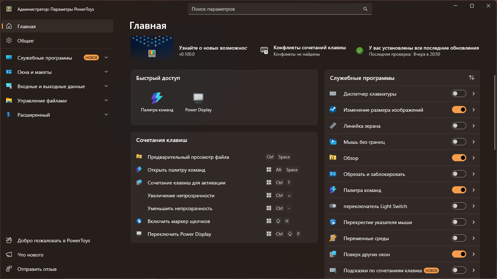
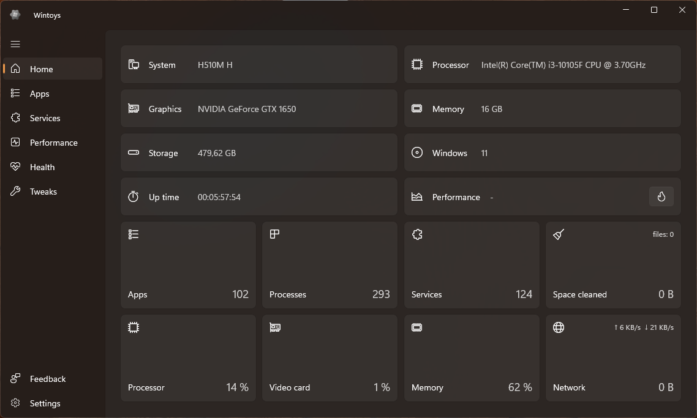
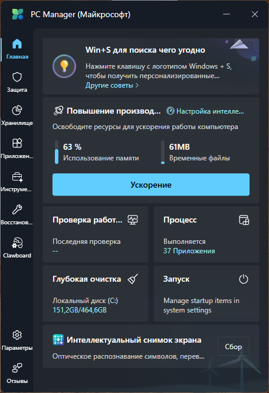
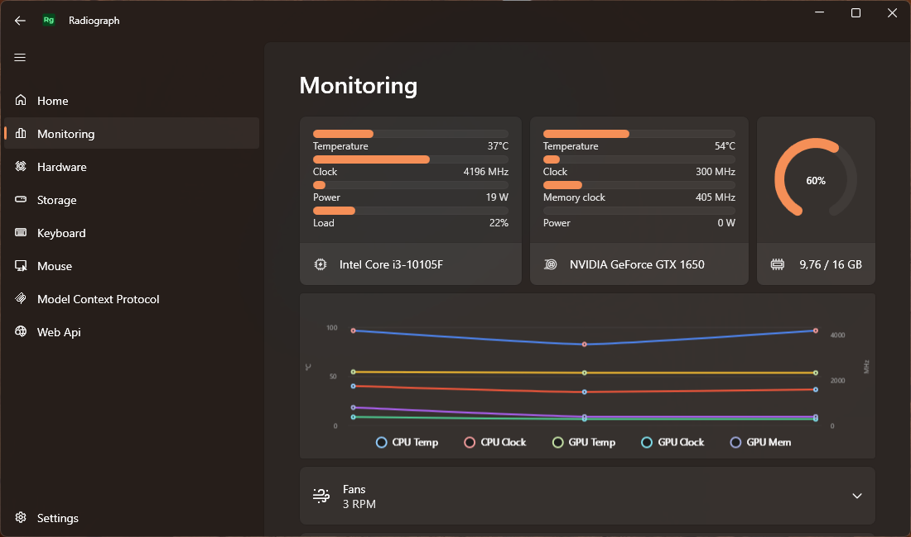
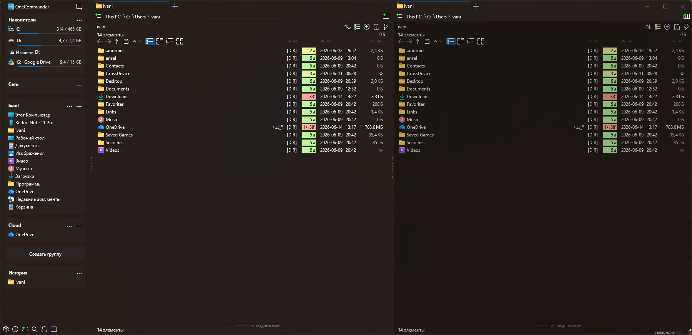
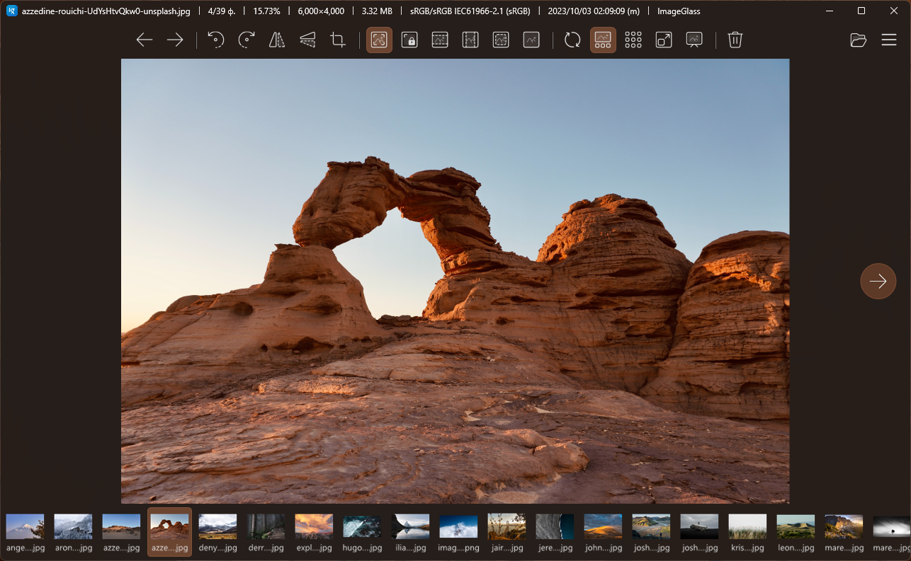
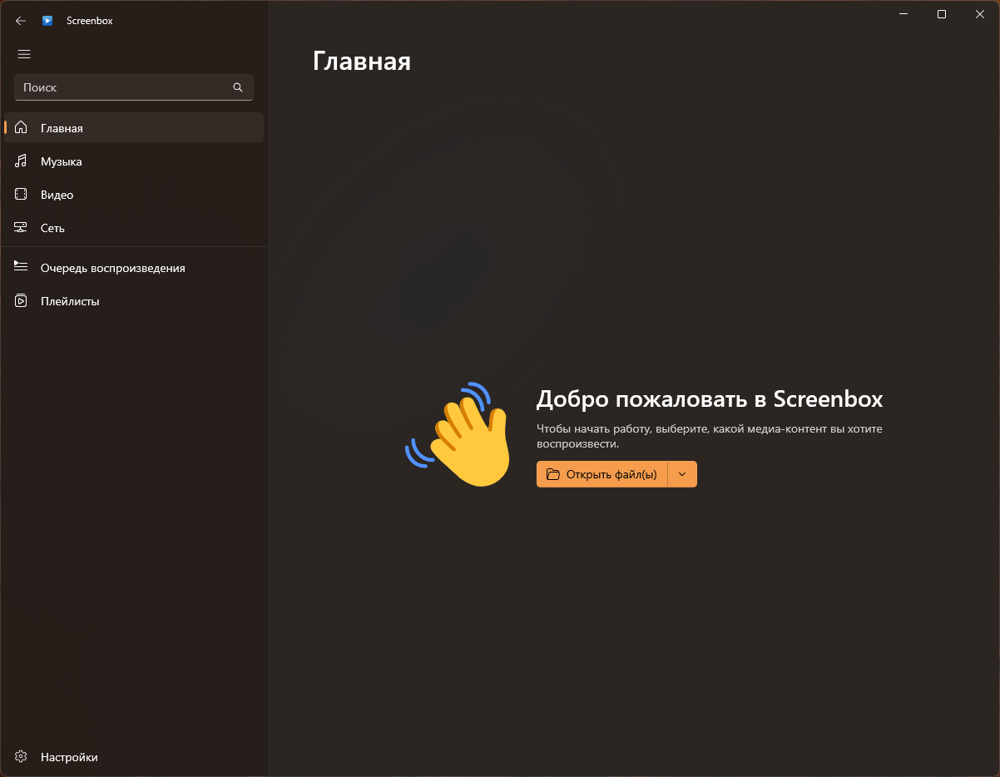
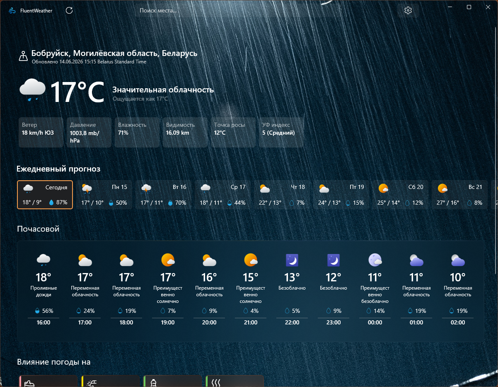
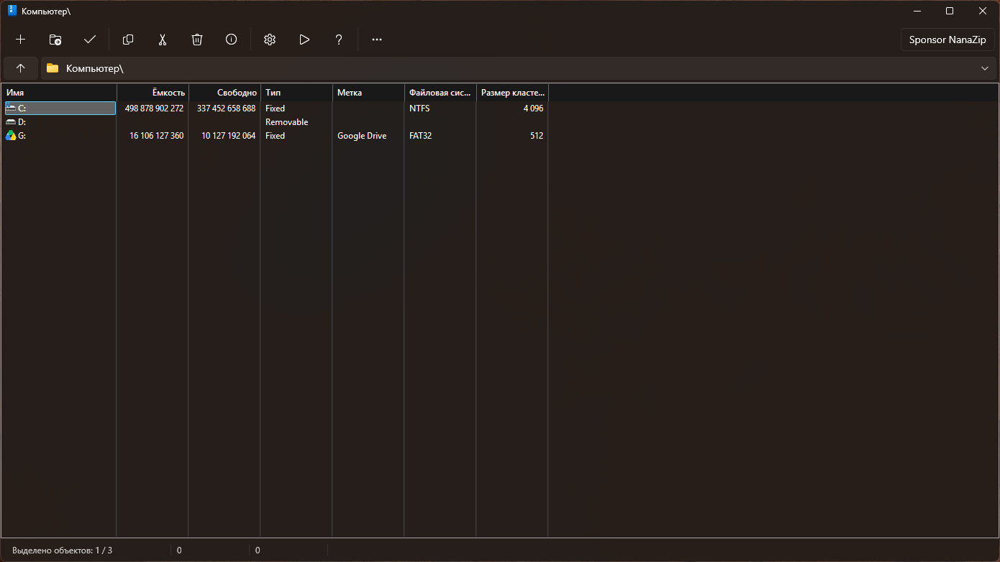
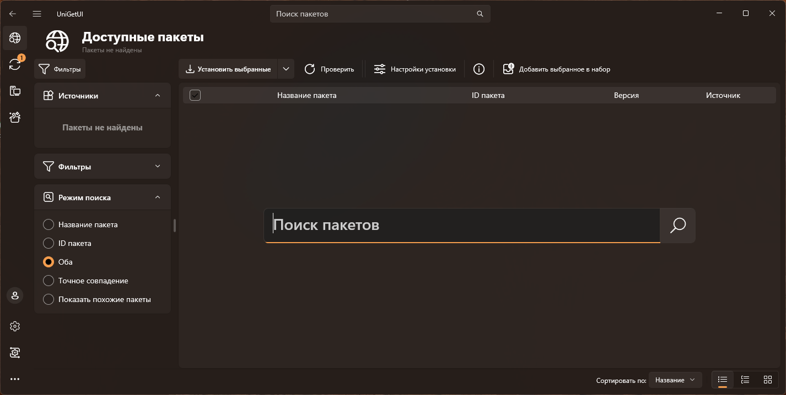

# Windows Power Apps

Windows Power Apps — это набор профессиональных инструментов для Windows 11/10,
который устанавливается через автоматический winget-скрипт и включает современные
утилиты для работы, настройки и оптимизации системы.

---

## 📦 Основные приложения (устанавливаются автоматически)

### PowerToys

### Wintoys

### Microsoft PC Manager

### Radiograph

### OneCommander

### ImageGlass

### Screenbox

### Fluent Weather

### NanaZip

### UniGetUI

---

## 🧩 Дополнительные приложения (ручная установка)

В папке **Installers** находятся дополнительные расширения и утилиты,
которые не доступны в winget и устанавливаются вручную.

Примеры:

- SteamPal for Command Palette  
- Process Killer for Command Palette  
- WebSearchShortcut Extension  
- ECP (CmdPal Extension)  
- EverythingCP Extension  

---

## 🚀 Как установить

1. Распакуйте архив **Windows-Power-Apps-main.zip** в любую папку.  
2. Запустите **PowerAppsSetup.bat** от имени администратора.  
3. Дождитесь завершения установки всех основных программ.  
4. При необходимости установите дополнительные утилиты из папки *Installers*.  
5. Перезагрузите компьютер.

---

## ℹ Примечание

Для успешной установки всех приложений требуется наличие Microsoft Store.  
Wintoys поддерживается на Windows 11 и Windows 10 версии **19044.1706** или новее.
